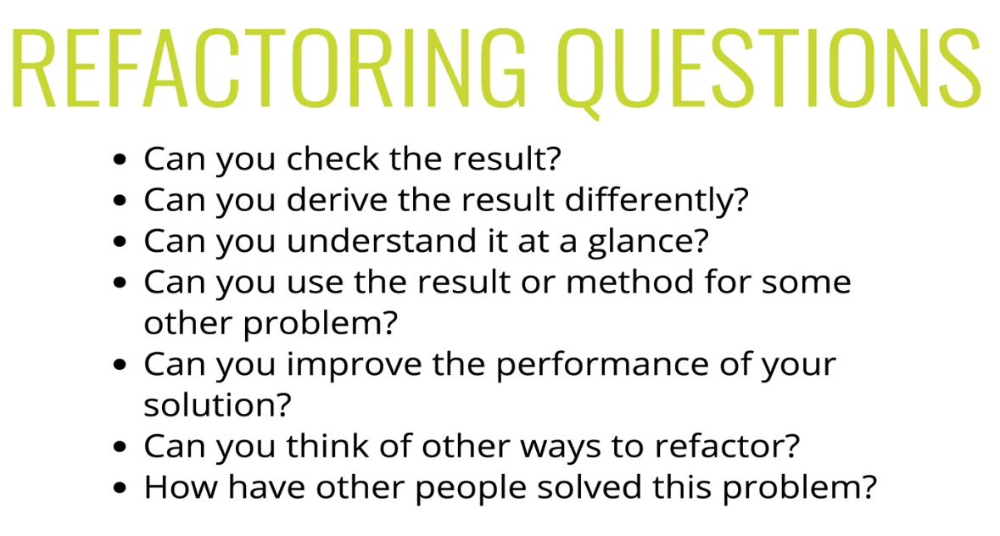

# Algorithms and Problem Solving Patterns - Approach

## 18: Intro to Problem Solving

> Algorithm: a **process** or **set of steps** to accomplish a certain task.

- Almost everything you do in programming involves some kind of algorithm... also, interviews.

- How to Improve:
  - **Devise** a plan for solving problems
  - **Master** common problem solving patterns

##### Problem Solving
  - Understanding the Problem 
  - Explore Concrete Examples
  - Break It Down
  - Solve/Simplify
  - Look Back and Refactor

## 19: **Step 1:** Understanding the Problem

  - The hardest part of being a developer is solving **new** problems.

  > It is really important to have a strong problem solving skill set

  - It is worth being deliberate and having a game plan, a step by step guide to help you think about how to solve problems

##### Understanding the Problem:

  - An important first step to take is to understand the problem ahead of you.
  - Thoroughly investigate the problem and ask clarifying questions before you get started on anything else.
 
  - To Begin:
    - Can I restate the problem in my own words?
    - What are the inputs to the problem?
    - What are the outputs to the problem?
    - Can the outputs be determined by the inputs to the problem?
      - In other words: Deo you have enough information to solve the problem?
    - How should I label the important pieces of data that are a part of the problem?

## 20: **Step 2:** Explore Concrete Examples

  - **Come up with concrete examples**

  - Helps with sanity checks
  - Start with **simple examples**
  - Progress to more complex examples
  - Explore examples with **empty inputs**
  - Explore examples with **invalid inputs**
  - Explore information we have access to at the beginning of the problem?
  - Explore edge cases

## 21: **Step 3:** Break It Down

  - What a lot of interviewers are looking for is for you to communicate.
    - Sometimes you can get hints this way
 

  - Explicitly write down the steps you need to take **(Show the interviewer your process)**.
    - This forces you to think about the code you will write before you start writing it.
      - This will help you catch any lingering conceptual issues or misunderstandings before you dive in, and add language syntax to the mix. 

## 22: **Step 4:** Solve/Simplify

  - If you are ready to solve the problem, solve it.
  - If you are about 80% there and there is something you are still hung up on, simplify the problem and solve that, then circle back around to the original problem.
  - If you're stuck on one part of the problem, and making no progress, solve a simpler problem so you have something to show for yourself.

  > - A good idea if you know what functionality you need to achieve to solve the problem, but you don't know how to write it, is to wrap that functionality in a function and place that function in your algorithm, but leave the actual function definition undefined.
  >   - An example would be isAlphaNumeric() to solve whether a char is a letter or a number. Then you can talk about refactoring it as well.

## 23: **Step 5:** Look Back & Refactor

  - It is really important in an interview to discuss out load the parts you don't like or may be able to refactor.
  - How can you make it perform better?
  - How have other people solved this problem? (afterwards?)
 

