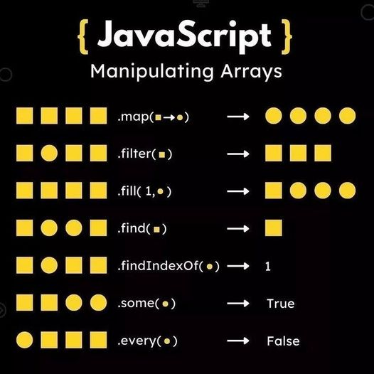

# Javascript Notes

These are notes specific to Javascript as a language that may come in handy during coding interviews.

### Contents:

1. Built In Methods
2. Operators

---

## 1. Built In Methods

#### Number:

  [Link](https://developer.mozilla.org/en-US/docs/Web/JavaScript/Reference/Global_Objects/Number)

  - `numberInstance.toString()`
    - Parameters:
      - ( )
        - If no argument is passed in, base 10 will be assumed.
      - (radix)
        - An integer in the range 2 through 36 specifying the base to use for representing numeric values.
    - Code Questions:
      - number palindrome

 

#### Array:

---

## 2. Operators

  #### **in**

  - The **in** operator **returns true if the specified property is in the specified object** or its prototype chain.

  - syntax

>   prop **in** object