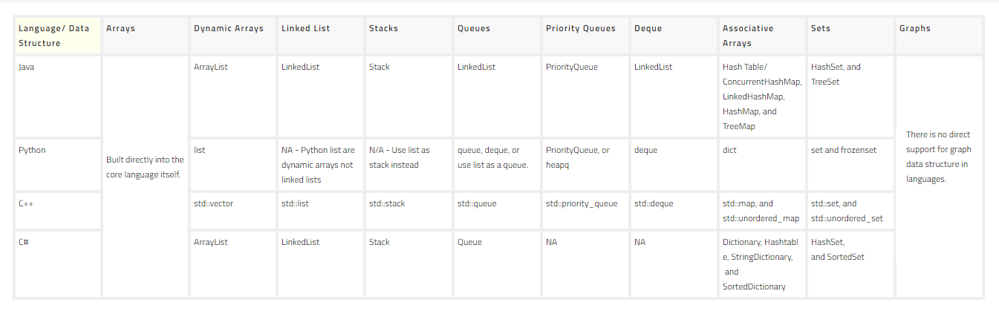

# Data Structures: Introduction

- **Data Structure:** A collection of values.
- **Algorithms:** The steps or processes we put in place to manipulate these collections of values.

### Data Structures + Algorithms = Programs

- Programmers understand Data Structures and Algorithms
- Data Structures and Algorithms are more fundamental than any programming language or framework, and as such can be used with any of them. 
- **From front end to game development, underneath it all, it's all data structures and algorithms. If you understand these you can tackle all sorts of technical problems.**
  - This is why top companies ask questions specific to DS&A, because if you understand DS&A they can through you any problem and you will be able to make the right decision.
  - **You need to be familiar with DS&A to be a great programmer.**

#### What is a Data Structure?

- A Data Structure is a collection of values, the values can have relationships between them, or functions applied to them. 
  - Each one is different in what it can do and what it is best used for.
 

- You can think of data structures as different types of containers:
  - A backpack, or a toolbox, or a refrigerator, etc...
  - Each container is specific to it's own thing.
  - You wouldn't store your homework in the fridge...
- **A data structure is a way for us to organize data.**
 

- **Two Points to Understanding a Data Structure:**
  - How it is Built
  - How it is Used

#### How Computers Store Data:

- Data Structures define how data is stored in memory
- Different data structures have different pros and cons for things like accessing and writing, etc..

#### Data Structures in Different Programming Language

- Each language has their own data types and definitions of those types.
- Example:
 

#### Operations on Different Data Structures

- Each data structure has their own trade offs when interacting with the data structure.
  - Types of Interactions:
    - Access
    - Search
    - Insertion
    - Deletion
    - etc..