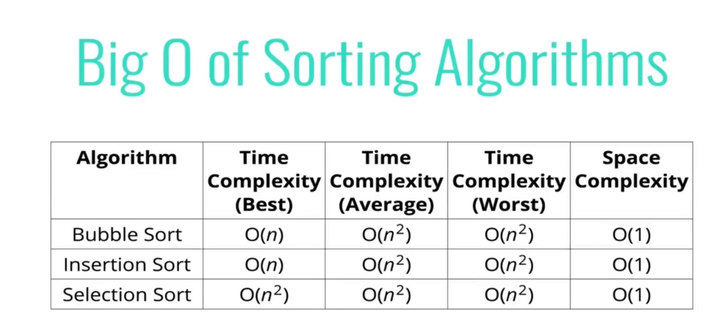

# Comparing Bubble Sort, Selection Sort, Insertion Sort

## 81: Comparing Bubble, Selection, and Insertion Sort:

- Called the "Quadratic" sorting algorithms because the BigO of all of them is **O(n^2)**
- They are all sort of roughly equivalent 

 

> **We can do better than this, but we have to have more complex algorithms to achieve this.**