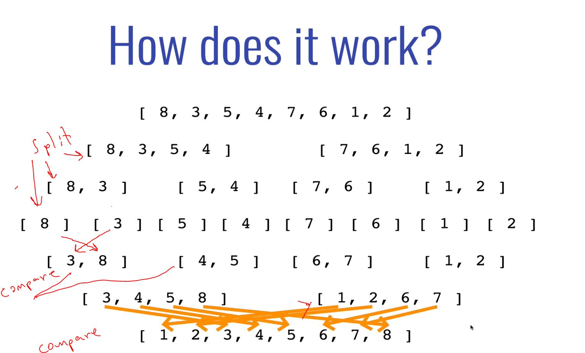
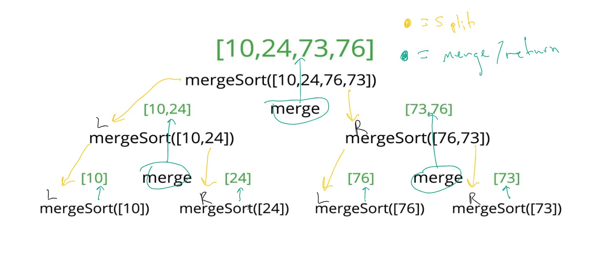

 

# Merge Sort

## 83: Intro to the "Crazier" Sorts

- Merge sort is the first of the "faster" sorting algorithms, at O(n<sup>log n</sup>)
- The trade off:
  - Efficiency for Simplicity
  - Generally, the more efficient the algorithm, the harder it is to understand. 

---
<br>

## 84:  Merge Sort: Introduction

- Created in 1948 by John von Neumann, on a vacuum tube computer.
- In a nut shell, merge sort is a combination of splitting, merging, and sorting.
- It exploits the fact that arrays of 0 or 1 elements are already sorted. 
- Merge sort works by decomposing an array into smaller arrays of 0 or 1 elements, then building up a newly sorted array. 

---


<br>

> Merge Sort is a "divide and conquer" algorithm. 

---
<br>

## 85: Merging Arrays Intro

- Assuming that that the arrays are sorted, we will first write a function to merge two arrays.

- In order to implement merge sort, it's useful to first implement a function responsible for merging two sorted arrays.
- Give two arrays that are sorted, this helper function should create a new array which is also sorted, and consists of all of the elements in the two input arrays.
- This function will run in **O(n + m) time** and **O(n + m) space**
  - It should not modify the parameters passed two it.

### Merging Array Pseudo Code:

  - Create an (results) empty array
  - Look at the smallest values in each input array
  - While there are still values in the array to look at:
    - If the value in the **first** input array is smaller than the value in the **second** input array:
      - *Push the first array value into our results array, then move onto the next smallest value in that array.*
    - Else, if the value in the **second** input array is smaller than the value in the **first** input array:
      - *Push the second array value into our results array, then move onto the next smallest value in that array.*
  - Once there are no more values in one of the arrays, we push the remaining values from the other array in.

```js

function mergeArrays(arr1, arr2) {
  let resultsArr = [];
  let i = 0;
  let j = 0;

  while (arr1[i] && arr2[j]) {
    if (arr1[i] < arr2[j]) {
      resultsArr.push(arr1[i]);
      i++;
    } else {
      resultsArr.push(arr2[j]);
      j++;
    }
  }

  while (arr1[i]) {
    resultsArr.push(arr1[i]);
    i++;
  }

  while (arr1[j]) {
    resultsArr.push(arr2[j]);
    j++;
  }

  return resultsArr;
}

```
---
<br> 

## 87: Writing Merge Sort Part 1

- Goal is to first break the array up into halves until you have arrays that are empty or have one element.
- Once we have those smaller sorted arrays, we merge them back together using our merge function until we are back to one full length array.
- Then we return the sorted array

---
<br>

## 88: Writing Merge Sort Part 2


### My (functional) Attempt:

```js

function mergeSort(arr){

    const mid = Math.floor(arr.length / 2)
    const arrFirstHalf = arr.slice(0, mid);
    const arrSecondHalf = arr.slice(mid, arr.length);

    let a = [];
    let b = [];

    if(arrFirstHalf.length > 1) {
      a = mergeSort(arrFirstHalf);
    } else {
      a = arrFirstHalf;
    };

    if(arrSecondHalf.length > 1) {
      b = mergeSort(arrSecondHalf)
    } else {
      b = arrSecondHalf;
    };

    console.log(a, b)
    console.log("merge call")
  return mergeArrays(a, b);
}

```
### Course Solution:

```js

function mergeSort(arr){

  //recursive function base case
  if(arr.length <= 1) return arr;

  let mid = Math.floor(arr.length/2);
  const left = mergeSort(arr.slice(0, mid));
  const right = mergeSort(arr.slice(mid, arr.length));

  return mergeArrays(left, right);
}

```


<br>

---
<br>

## 85: Merge Sort BIG O Complexity
<br>


