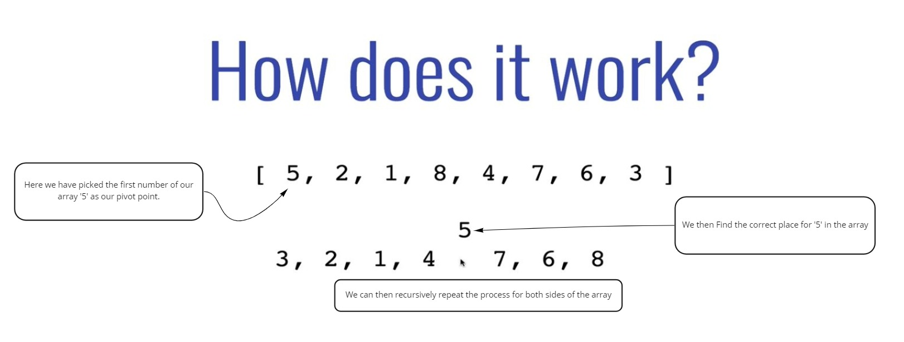

 
 # Quick Sort

## 91: Intro to the Quick Sort:

- Like merge sort, quick sort exploits the fact that arrays of 0 and 1 elements are always sorted.

> Works by selecting one element called the **pivot** and finding the index where the pivot should end up in the sorted array.

- Once the pivot is in the correct place in the array, quick sort can be applied to either side of the pivot.

- How does it work?



## 92: Pivot Helper (Also called Partition):

- In order to implement quicksort, it is useful to first implement a helper function responsible for arranging elements in an array on either side of a given pivot.

- Given an array, this helper function should:
  - designate an element as the pivot.
  - rearrange elements in the array so that:
    -  all values **less than the pivot** are moved to the **left** of the pivot
    -  all values **greater than the pivot** are moved to the **right** of the pivot.
- **The order of the elements on either side of the pivot doesn't matter!**
- The helper should do this **in place**, no new array needed.
- When complete, the helper should return the index of the pivot.

> The runtime of quick sort can change depending on where you pick the pivot from.

- **Ideally, the pivot should be chosen so that it is roughly the median value in the dataset you're sorting** 
  - This is not so easy in an unsorted array, so we usually pick the first, last, or middle element.

### Pivot Pseudo Code:
  - Using the first element of out array as the pivot

  - Pivot will accept three arguments `an array, a start index, an end index` can add defaults
  - Grab the pivot from the beginning of the array 
  - Store the current pivot index in a variable (this will keep track of where the pivot ends up)
  - Loop through the array from the start until the end
    - if the pivot is greater than the current element, 
      - increment the pivot index variable,
      - then swap the current element with the element at the pivot index.
  - Swap the starting element (i.e. the pivot) with the pivot index
  - Return the pivot index

## 93. Pivot Helper (Partition) Implementation:

```js

  function pivot(arr, start = 0, end = arr.length - 1){

    function swap(arr, i, j){
      let temp = arr[i];
      arr[i] = arr[j];
      arr[j] = temp;
    }
    
    let pivot = arr[start]; //<-------------- Pivot is the VALUE, start is the position!
    let swapIdx = start;
  
    for(let i = start + 1; i < arr.length; i++){
      if(pivot > arr[i]){
        swapIdx++;
        swap(arr, swapIdx, i);
      }
    }
    swap(arr, start, swapIdx);
    return swapIdx;
  }
```

## 94. Quick Sort Implementation:

### Quicksort Pseudo Code:

- Call the pivot helper on the array
- When the helper returns the updated pivot index: 
  - recursively call the pivot helper on the subarray to the **left** of the pivot, 
  - the recursively call the pivot helper on the subarray to the **right** of the pivot

- The base case occurs when you consider a subarray with less than 2 elements

### Code:

```js

  function quickSort(arr, left = 0, right = arr.length - 1){
    if(left < right){
      let pivotIndex = pivot(arr, left, right);

      quickSort(arr, left, pivotIndex - 1); //one under pivot
      quickSort(arr, pivotIndex + 1, right); //one over pivot
    }
    return arr;
  }

```

## 96. Quick Sort Big O Complexity


- Best case is the same as Merge Sort O(n log n)
- The best case scenario arises when the pivot point is the median value


- Worst Case is 0(n)
- The worst case scenario arises when the array we are attempting to sort is already sorted.
  - Or, pivoting around the min or the max of the array.

