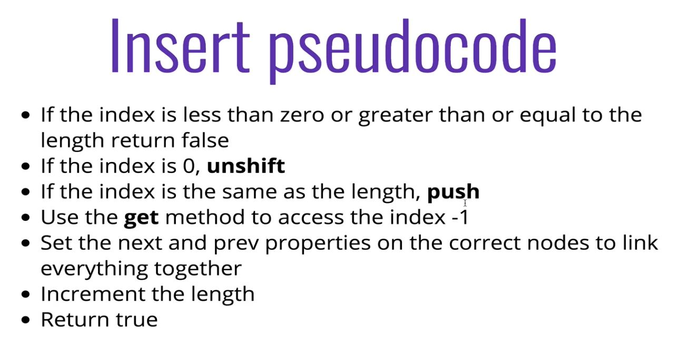

# Doubly Linked Lists

## 130: Doubly Linked Lists Intro

> **Almost identical to Singly Linked Lists, except every node has a pointer to the next node, and a pointer to the previous pointer.**


---


## 131 - 147: Setting Up Doubly Linked List Class

```js

  class Node(){

    constructor(val){
      this.val = val;
      this.next = null;
      this.prev = null;
    }
  }

  class DoublyLinkedList(){

    constructor(){
      this.head = null;
      this.tail = null;
      this.length = 0;
    }

    // Adding a node to the end of the DLL
    push(val){
      let node = new Node(val);

      if(this.length === 0){
        this.head = node;
        this.tail = node;
      } else {
        this.tail.next = node;
        node.prev = this.tail;
        this.tail = node;
      }
      this.length++;
      return this;
    }

    // removing a node from the end of the DLL
    pop(){
      if(!this.head) return undefined;

      let poppedNode = this.tail;

      if(this.length === 1){
        this.head = null;
        this.tail = null;
      } else {
        this.tail = poppedNode.prev;
        this.tail.next = null;
      }

      this.length--;
      return poppedNode;
    }

    // removing a node from the beginning of the DLL
    shift(){
      if(this.length === 0) return undefined;

      let oldHead = this.head;

      if(this.length === 1){
        this.head = null;
        this.tail = null;
      } else {
        this.head = oldHead.next;
        this.head.prev = null;
        oldHead.next = null;
        this.length--;
      }

      return oldHead;
    }

    // adding a node to the beginning of a DLL
    unShift(val){

      let newNode = new Node(val);

      if(this.length === 0){
        this.head = newNode;
        this.tail = newNode;
      } else {
        this.head.prev = newNode;
        newNode.next = this.head;
        this.head = newNode;
      }
      this.length++;
      return this;
    }

    // accessing a node in DLL by its position

    get(idx){
      if(idx < 0  || idx >= this.length) return null;

      if(idx < this.length/2){
        let count = 0;
        let current = this.head;
        while(count !== idx){
          current = current.next;
          count++;
        }
      } else {
        let count = this.length - 1;
        let current = this.head;
        while(count !== idx){
          current = current.prev;
          count--;
        }
      }

      return current;
    }

    //Replace the value of a node in a DLL
    set(val){
      let foundNode = this.get(index);
      if(foundNode !== null){
        foundNode.val = val;
        return true;
      }
      return false;
    }

    // adding a node in a DLL at a given position
    insert(){
      if(index < 0 || index > this.length) return false;
      if(index === 0) return this.unshift(val);
      if(index === this.length - 1) return this.push(val);

      let newNode = new Node(val);
      let beforeNode = this.get(index - 1);
      let afterNode = beforeNode.next;

      beforeNode.next = newNode;
      newNode.prev = beforeNode;
      newNode.next = afterNode;
      afterNode.prev = newNode;

      this.length++;
      return true;
    }

    // remove a node in a DLL at a given position
    remove(idx){
      if(index < 0 || index > this.length) return false;
      if(index === 0) return this.shift(val);
      if(index === this.length - 1) return this.pop();

      let removedNode = this.get(idx);

      removedNode.prev.next = removedNode.next;
      removedNode.next.prev = removedNode.prev;

      removedNode.next = null;
      removedNode.prev = null;

      this.length--;
      return removedNode;
    }

  }

```

---


---


---


---


---


--- 


--- 



--- 


## Time Complexity


### Recap:

