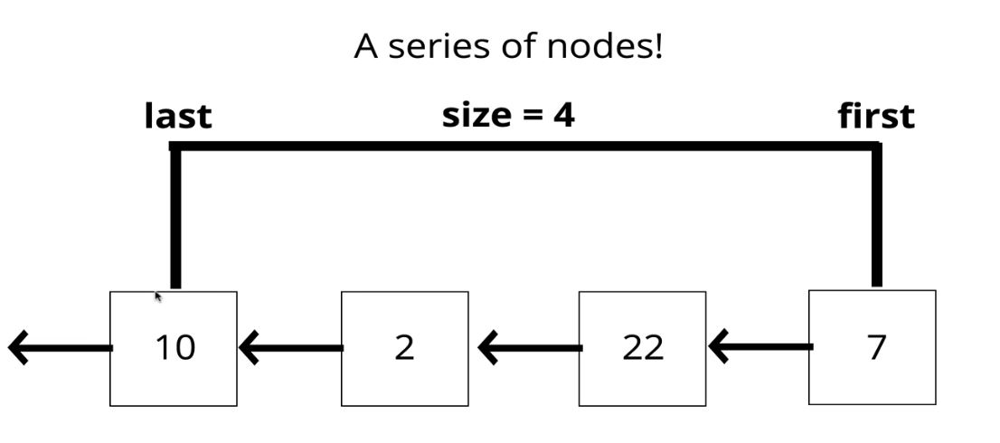
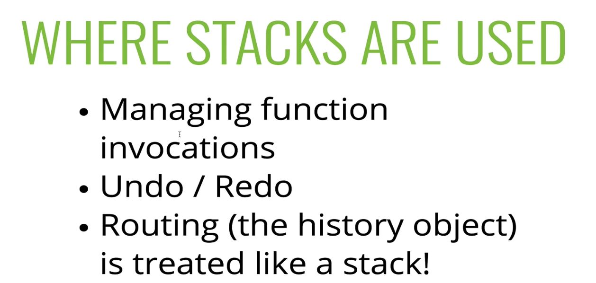

# Stacks and Queues

## 150: Intro to Stacks

> A LIFO (Last In First Out) Data Structure
><br>
> **The last element added to the stack will be the first element removed from the stack.**





## 151: Creating a Stack with an Array

> **A STACK IS A CONCEPT, A SET OF RULES WE FOLLOW: in this case where the first thing added in is the last thing removed, and the last thing added in is the first thing removed.**

- There is more than one way to implement a stack.
- Easy to implement with an array.

- Example:

```js

let stack = [];

// We add items to our stack with push
stack.push("google");
stack.push("youtube");
stack.push("instagram");

// We remove items from our stack with pop
stack.pop() // returns "instagram"
```

> We must follow the conventions of using a stack with an array, if we start accessing data from an index instead, it is no longer a stack.

- **Push and Pop methods is more efficient than Unshift and Shift, but not as efficient as a Stack built with an Linked List.**

## 152: Writing a Stack from Scratch ( Linked List Implementation)

> In this section we are using push and pop methods, but they are opposite of what they were on a linked list, we are pushing and popping from the beginning of the list when the list is a Stack. **This gives up constant time**

- All we really need for a stack is the ability to add and remove in a last in first out fashion, Arrays come with quite a bit more overhead.

### Base Stack Class

```js

class Node(val){
  constructor(val){
    this.val = val;
    this.next = null;
  }
}

class Stack(){
  constructor(){
    this.first = null;
    this.last = null;
    this.size = 0;
  }

  push(val){

  }

  pop(){
    
  }
}

```

### Push Pseudocode 

  - Accept a value
  - Create a new node
    - If there is no nodes in the stack
      - set **first** and **last** to be the new node
    - Else
      - create a variable, set it equal to the current **first** node on the stack
      - Set the **first** property to be the new node
      - Set the next property on the new node to be the variable we created
  - Increment size by one.


### Push Code

- This is **O(n)** time

```js

  push(val){
    let node = new Node(val);

    if(this.length = 0){
      this.first = node;
      this.last = node;
    } else {
      let temp = this.first;
      this.first = node;
      node.next = temp;
    }
    this.size++;
  }

```

### Pop Pseudocode 

  - If there is no nodes in the stack return null
  - Create temp var to store **first** property of stack
  - If there is only one node in the stack, set **first** and **last** to null
  - If there is more than one node, set first property to be the next property of the current **first**
  - Decrement size
  - return the **value** of the node removed

### Push Code

```js

  pop(){
    if(!this.size) return null;
    let temp = this.first;
    if(this.size === 1){
      this.last = null;
    }
    this.first = this.first.next;
    this.size--;
    return temp.val;
  }

```

## 153: The Big O of Stacks

- **Insertion:** O(1)
- **Removal:** O(1)
- * These are all you should really care about when it comes to a stack, if you need searching and access, you should use a different data structure.

- **Searching:** O(n)
- **Accessing:** O(n)


## 154: Intro to Queues

> A FIFO (First In First Out) Data Structure
><br>
> **The first element added to the Queue will be the first element removed from the Queue.**

- Think of a queue as waiting in a line. If you are the first one in line you will be the first one to leave the line.

- Used a lot on programming
  - Background tasks
  - Print queues
  - Gaming queues
<br>

- Just like Stacks, Queues can be implemented with Arrays or built from scratch.

## 155: Creating Queues with Arrays

- There is no "more" efficient way when using an array to make a queue

```js

let q = [];

q.unshift("first")
q.unshift("second")
q.unshift("thirst")

q.pop() // First
q.pop() // Second
q.pop() // Third

```

## 156: Creating a Queue from Scratch

### Base Queue Class

```js

class Node{
  constructor(val){
    this.val = val;
    this.next = null;
    }
}

class Queue{
  constructor(val){
    this.first = null;
    this.last = null;
    this.size = 0;
  }

  enqueue(val){

  }

  dequeue(){

  }
}

```

- The methods for Queues are **enqueue** and **dequeue**
- We are "pushing" on and "shifting" off

- Enqueue --> pushing  --> adding to the end of a list
- Dequeue --> shifting --> removing from the beginning of the list


### Enqueue Pseudocode

- Accept a value
- Create a new node using that value
  - If size is 0, set new node to be both **first** and **last** prop of Queue
  - Else, set the next property on the current **last** to be the new node 
    - then set the **last** prop to be the new node

### Enqueue Code

```js

  enqueue(val){
    let newNode = new Node(val);
    if(!this.size){
      this.first = newNode;
      this.last = newNode;
    } else {
      this.last.next = newNode;
      this.last = this.last.next;
    }
    return ++this.size;
  }

```

### Dequeue Pseudocode

- Identical to stack
<br>

  - If there is no nodes in the queue return null
  - Create temp var to store **first** property of stack
  - If there is only one node in the stack, set **first** and **last** to null
  - If there is more than one node, set first property to be the next property of the current **first**
  - Decrement size
  - return the **value** of the node removed

### Dequeue Code

```js

  dequeue(){
    if(!this.size) return null;
    let temp = this.first;
    if(this.size === 1){
      this.last = null;
    }
    this.first = this.first.next;
    this.size--;
    return temp.val;
  }

```

### Big O of Queues

- **Insertion:** O(1)
- **Removal:** O(1)
- * These are all you should really care about when it comes to a queues, if you need searching and access, you should use a different data structure.

- **Searching:** O(n)
- **Accessing:** O(n)