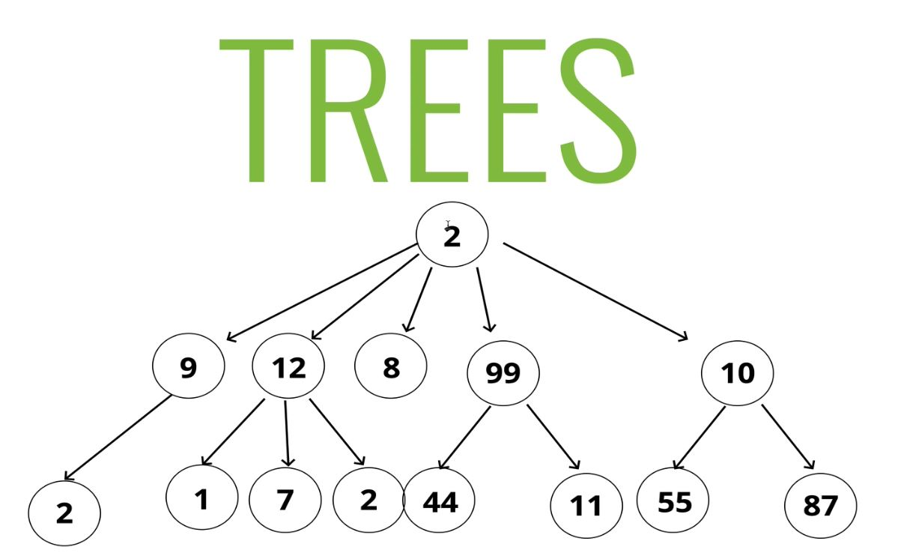
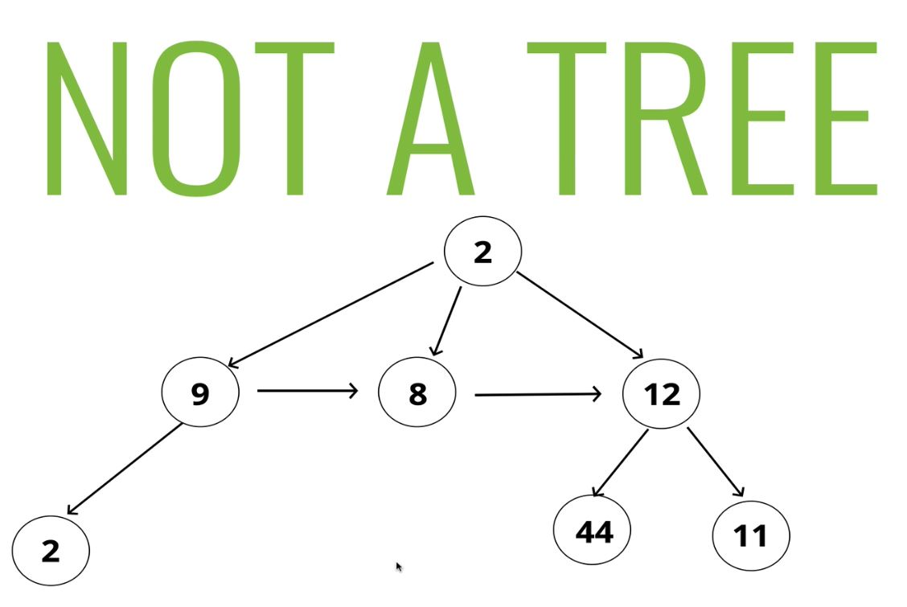

# Binary Search Trees

## 159: Intro to Trees

  > Trees are data structures which consist of nodes in a **parent / child** relationship.

  
  <br>

  - **Lists: Linear**
  - **Trees: Nonlinear**

  

  ### Tree Terminology:

    - **Root:** The top node in a tree.
    - **Child:** A node directly connected to another node when moving away from the root node.
    - **Parent:** A node directly connected to another node when moving towards the root node.
    - **Siblings:** A group of nodes who share a single parent.
    - **Leaf:** A node with no children.
    - **Edge:** The connection between two nodes.

## 160: Uses for Trees

  - HTML DOM
  - Network Routing
  - Abstract Syntax Tree
  - Artificial Intelligence
  - Folders in an Operation System
  - **JSON**

## 161: Kinds of Trees

  - Some Trees have specific conditions placed on them

  - General Trees
  - Binary Trees
    - Every parent has at most two children.
  - Binary Search Trees
    - Binary trees, but the nodes are ordered and store sorted data.
    - Every parent has at most two children.
    - Every node to the left of a parent node is always less than the parent
    - Every node to the right of a parent node is always greater than the parent.

## 163: Searching in a BST

  - Searching is very quick O(log n) compared to an unsorted tree O(n)

## 164: Setting up BST Class

  ### Base Class:

  ```js

  class Node{
    constructor(val){
      this.left = null;
      this.right = null;
      this.value = val;
    }
  }

  Class BST{
    constructor(){
      this.root = null;
    }
  }

  ```

## 165: Inserting into a BST

### Insert Pseudocode: 

  - Accept a value
  - Create a new node
  - Starting at the root:
    - Check if there is an existing node
      - If not, the created node is placed there
      - If there is,
        - Check to see if the value of the new node is greater than or less than the value of that node.
          - Greater:
            - Check to see if there is a node to the right
              - If so, move to that node and repeat
              - If not, add that node as the right property
          - Less than:
            - Check to see if there is a node to the left.
              - If so, move to that node and repeat
              - If not, add that node as the left property

### Insert Code

  ```js
  // Explicit Iterative Insert
  insert(val){
    let newNode = new Node(val);

    if(!this.root){
      this.root = newNode;
      return this;
    } else {
      let current = this.root;
      while(true){
        if(value === current.value) return undefined;
        if(value < current.value){
          if(!current.left){
            current.left = newNode;
            return this;
          } else {
            current = current.left;
          }
        } else if (value > current.value){
          if(!current.right){
            current.right = newNode;
            return this;
          } else {
            current = current.right;
          }
        }
      }
    }
  }

  ```

## 167: BST: Find

- Finding a node in a BST can be done iteratively or recursively

### Remove Pseudocode

  - Accept a value
  - If there is no root return true
  - if there is a root and it's value matches the passed in value return true
  - If not:
    - Check to see if the value is greater than the root nodes value
    - If greater:
      - if there is a right node
        - move to that node and repeat
      - if not
        - return false
    - If less:
      - If there is a left node
        - move to that node and repeat
      - If not
        - return false


```js

    find(val){
      if(!this.root) return false;

      let current = this.root;
      let found = false;

      while(current && !false){
        if(val < current.value){
          current = current.left;
        } else if(val > current.value){
          current = current.right;
        } else {
          found = true;
        }
      }
      return found ? current : false;
    }

```

## 169: BST: Big O

  - A balanced BST
    - Inserting: O(log n)
    - Searching: O(log n)

  - There is a case where your BST is only one sided, and one child each (not common) in that case the time drops to O(n)