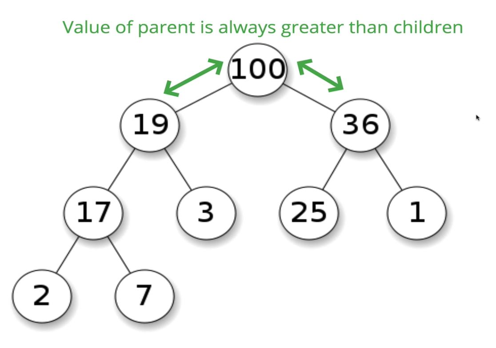
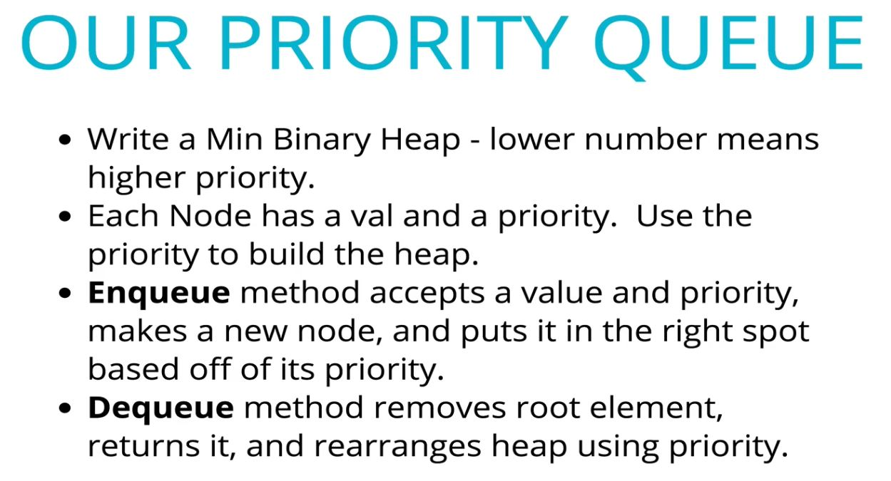

# Binary Heaps

## 182: Intro to Heaps

> A Heap is very similar to a binary search tree, but it has different rules.

#### Two Types:

  - **MaxBinaryHeap**: Parent nodes are always larger than child nodes.
  - **MinBinaryHeap**: parent nodes are always smaller than child nodes.





<br>

183: Storing Heaps

> We can store binary heaps in **Arrays**.

### Finding the Children of a Given Node:


### Finding the Parent of a Given Node:


## 184: Heap Insert Intro

- Max and Min code is almost interchangeable, so the example will be a max binary tree.


- Adding to a Max Binary Heap:
  - Add to the End
  - Bubble Up
    - Swap until it is in it's correct spot

### Pseudocode


## 185: Heap Solution


```js

  class MAxBinaryHeap {

    constructor(){
      this.values = []; // for a Binary heap, we will store the values within an array
    }

    insert(element){
      this.values.push(element);
      this.bubbleUp(); // can do this logic withing the insert function, this is just a little easier to read.
    }

    bubbleUp(){
      let idx = this.values.length - 1;
      const element = this.values[idx]; // grab the last value in the array (the one we just inserted);

      // loop while the idx is in range
      while(idx > 0){
        let parentIdx = Math.floor((idx - 1) / 2); // This step finds the parent node of a given element
        let parentVal = this.values[parentIdx];

        if(element <= parentVal) break; // compare the value of the element we are inserting against the current parent nodes value, break if greater or equal

        // swap the value of the parent element with the value of the element
        this.values[parentIdx]= element;
        this.values[idx] = parentVal;

        // update the index
        idx = parentIdx;
      }
    }

  }

```

## 186: Heap: ExtractMax Intro

- In general, **with a maxBinaryTree you extract the maximum value (the root)**, and **with a mixBinaryTree you extract the minimum value (the root)**


- When removing, effectively what we do is remove the head, swap the last value in the values array with the head


- then bubble the new head value down until it is in the correct location.

;

### Pseudocode


## ExtractMax Solution

```js

  extractMax(){

    // take the max node off the beginning of the array, remove the last node, set last node to be the first node
    const max = this.values[0];
    const end = this.values.pop();
    this.values[0] = end; 

    // sink the current first value down to the correct location, then return the max value
    this.sinkDown();
    return max
  }

  sinkDown(){
    let idx = 0;

    const len = this.values.length;
    const element = this.values[0];

    while(true){
      let leftChildIdx = 2 * idx + 1;
      let rightChildIdx = 2 * idx + 2;
      let leftChildVal, rightChildVal;

      let swap = null;

      if(leftChildIdx < len){
        leftChildVal = this.values[leftChildIdx];
        if(leftChildVal > element){
          swap = leftChildIdx;
        }
      }
      if(rightChildIdx < len){
        rightChildVal = this.values[rightChildIdx];
        if(
            (swap === null && rightChildVal > element) || 
            (swap !== null || rightChildVal > leftChild)
          ){
          swap = rightChildIdx;
        }
      }
      if(swap === null) break;
      this.values[idx] = this.values[swap];
      this.values [swap] = element;
      idx = swap;
    }
  }

```

## 188: Priority Queue Intro


- A Priority Queue doesn't have to be implemented with a maxBinaryHeap, it is just an efficient way of doing so.


- **A Priority Queue implemented with a maxBinaryHeap has a time complexity of O(log n) vs O(n) when implemented with an array**

## 189: Priority Queue Pseudocode

```js

  class PriorityQueue{
    
    constructor(){
      this.values = [];
    }

  }

```




## 190: Priority Queue Solution

```js

  class PriorityQueue{
    
    constructor(){
      this.values = [];
    }

    enqueue(val, priority){
      let node = new Node(val, priority)
      this.values.push(newNode);
      this.bubbleUp();
    }

    bubbleUp(){
      let idx = this.values.length - 1;
      const element = this.values[idx]; // grab the last value in the array (the one we just inserted);

      // loop while the idx is in range
      while(idx > 0){
        let parentIdx = Math.floor((idx - 1) / 2); // This step finds the parent node of a given element
        let parentVal = this.values[parentIdx];

        if(element.priority >= parentVal.priority) break; // compare the value of the element we are inserting against the current parent nodes value, break if greater or equal

        // swap the value of the parent element with the value of the element
        this.values[parentIdx]= element;
        this.values[idx] = parentVal;

        // update the index
        idx = parentIdx;
      }
    }

    dequeue(){

    // take the max node off the beginning of the array, remove the last node, set last node to be the first node
    const min = this.values[0];
    const end = this.values.pop();

    if(this.values.length > 0){
      this.values[0] = end; 
      this.sinkDown();
    }

    // sink the current first value down to the correct location, then return the max value
    return min
  }

  sinkDown(){
    let idx = 0;

    const len = this.values.length;
    const element = this.values[0];

    while(true){
      let leftChildIdx = 2 * idx + 1;
      let rightChildIdx = 2 * idx + 2;
      let leftChildVal, rightChildVal;

      let swap = null;

      if(leftChildIdx < len){
        leftChildVal = this.values[leftChildIdx];
        if(leftChildVal.priority < element.priority){
          swap = leftChildIdx;
        }
      }
      if(rightChildIdx < len){
        rightChildVal = this.values[rightChildIdx];
        if(
            (swap === null && rightChildVal.priority < element.priority) || 
            (swap !== null || rightChildVal.priority < leftChild.priority)
          ){
          swap = rightChildIdx;
        }
      }
      if(swap === null) break;
      this.values[idx] = this.values[swap];
      this.values [swap] = element;
      idx = swap;
    }
  }

  }

  class Node{
    constructor(val, priority){
      this.val = val;
      this.priority = priority;
    }
  }

```

## 191: Big O Binary Heaps


- Not really made to be searchable

