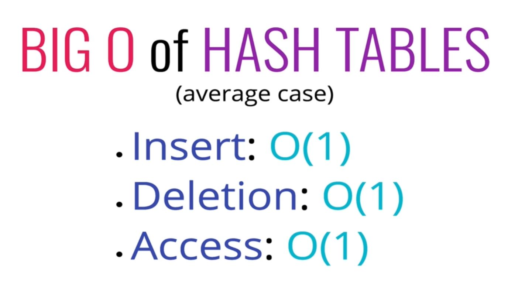
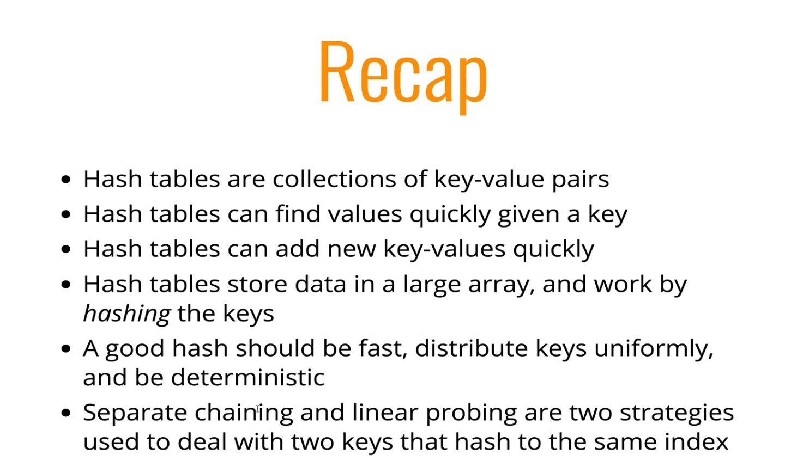

# Hash Tables

## 193: Intro to Hashtables

- Known as **Hash table** or **Hash map** or **Map** (kind of Objects as well, but you can only use strings as keys)
- Pretty much every language has one built in as a default type.

> Hashtables are used to store **key-value** pairs.
> They are like arrays, but the keys are not ordered.
> 
> Unlike arrays, hashtables are fast for all of the following operations: 
>   - **finding values**
>   - **adding new values**
>   - **removing values**
>
> **They are used ALOT**


## 194: More About Hash Tables

> **Hashtables allow for human readability, while not sacrificing computer readability.**

<br>

#### Building our own Hashtable: 
<br>
- To implement a hashtable, we'll be using an array.
- In order to look up values by key, we need a way to convert keys (*think strings for human readability*) into valid array indices.
- The function that performs this task is called a **hash function**
  - These get very complex in the real world, but they don't need to be too complex for basic functionality.


## 195: Intro to Hash Functions

- A basic hash function is going to take data of a fixed size, and it is going to map it to a fixed size.

- A good hash function is:
  - **Fast** (i.e. constant time)
  - **Doesn't cluster outputs** at specific indices (distributes them uniformly)
  - **Deterministic** (the same input yields the same output every time)


## 196: Writing Our First Hash Function

- Will only take strings for this example

```js 

function hash(key, arrayLen){
  let total = 0;

  for(let char of key){
    // map "a" to 1, map "b" to 2, etc...
    let value = char.charCodeAt(0) - 96;

    total = (total + value) % arrayLen;
  }

  return total;
}

hash('pink', 10) // 0

```

#### Problems:

  - **It is not constant time**
  - **It only takes in strings** (not going to worry about that as much)
  - **Could be more random**


## 197: Improving Our Hash Function

- **Prime numbers in hash functions help spread the keys out more evenly**
- **It is also helpful if the length of the array you are putting values into is prime as well**

```js 

// Revised hash function

function hash(key, arrayLen){
  let total = 0;

  for(let i = 0; i < key.length || i < 100; i++){ // 100 char is enough for our purposes

    let WEIRD_PRIME = 31;
    
    let char = key[i];

    let value = char.charCodeAt(0) - 96;

    total = (total * WEIRD_PRIME + value) % arrayLen;
  }

  return total;
}


```

## 198: Dealing with Collisions 

- Even with a larger array and a great hash function, collisions are inevitable.

> **Two options for dealing with collisions:**
> 
> - **Separate Chaining**
> - **Linear Probing**

### Separate Chaining

> With **separate chaining**, at each index in our array we store values using a different data structure (e.g. an array or linked list).
> 
> This allows us to store multiple key-value pairs at the same index of the hash table.


### Linear Probing

> With **linear probing**, when we find a collision, we search through the array to find the next empty slot.
> 
> We only ever have a single key-value pair at any given index.

## 199-203: Implementing Our Hashtable

### Base Structure
```js

class hashTable {
  constructor(size = 53); //default size value of 53
  this.keyMap = new Array(size); // creating an array where we will store the data
}

_hash(key){
  let total = 0;
  const WEIRD_PRIME = 31;

  for(let i = 0; i < key.length || i < 100; i++){
    let char = key[i];
    let value = char.charCodeAt(0) - 96;
    total = (total * WEIRD_PRIME + value) % this.keyMap.length;
  }

  return total;
}


```

### Set and Get Methods

#### Pseudocode: 

##### Set:  

  - Accepts a key and a value
  - Hashes the key
  - Stores the key-value pair in the hash table array, via separate chaining

##### Get:

  - Accepts a key
  - Hashes the key
  - Retrieves the key-value pair in the hash table
  - if the key isn't found, return `undefined`

#### Code:

```js

  // set values at key in our hashtable
  set(key, value){
    
    //first we hash our key to create the index we will use for the hash table
    let index = this._hash(key);

    //check to see if anything exists at that index
    if( !this.keyMap[index]){
      // create an Array at that index
      this.keyMap[index] = [];
    }

    // place key-value pair in the array at the index 
    this.keyMap[index].push([key, value]);
  }


  // get values at key in our hashtable
  get(key){

    //first we hash our key to create the index we will use for the hash table
    let index = this._hash(key);

    // next we check if there is anything at that index, return undefined if not
    if(!this.keyMap[index]) return undefined

    // loop over the array at the index as determined above
    for( let array in this.keyMap[index]){

      // for each array in the indexed array, check to see if the key matches the passed in key
      if(array[0] === key) return array[1]; // return the value at that key if found
    }

    // return undefined if no value is found
    return undefined;
  }


```
### Keys and Values Methods

#### Pseudocode: 

##### keys: 

  - Loop through the hash table array and return an array of keys in the table.

##### values:

  - Loop through the hashtable array and returns an array of values in the table.

#### Code:

```js

  values(){

    // create an empty array which will hold our values
    let values = [];

    // loop over our hash table 
    for(let i = 0; i < this.keyMap.length; i++){

      // check if there is data at a given index
      if(this.keyMap[i]){

        // for the array at a given index, loop over the arrays held within (if data exists at the hashMap index there is at least one k-v pair)
        for(let j = 0; j < this.keyMap[i].length; j++){

          // in order to not return duplicate data,
          // check if the value we want is already in our values array, if not push the value at a give k-v pair.
          if(!values.includes(this.keyMap[i][j][1])) values.push(this.keyMap[i][j][1]);
        }
      }
      return values;
    }
  }

    values(){

    // create an empty array which will hold our keys
    let keys = [];

    // loop over our hash table 
    for(let i = 0; i < this.keyMap.length; i++){

      // check if there is data at a given index
      if(this.keyMap[i]){

        // for the array at a given index, loop over the arrays held within (if data exists at the hashMap index there is at least one k-v pair)
        for(let j = 0; j < this.keyMap[i].length; j++){

          // in order to not return duplicate data,
          // check if the keys we want is already in our values array, if not push the key at a give k-v pair.
          if(!keys.includes(this.keyMap[i][j][0])) keys.push(this.keyMap[i][j][0]);
        }
      }
      return keys;
    }
  }

```

## 204: Hash Table Big O Complexity



--- 

## Recap

