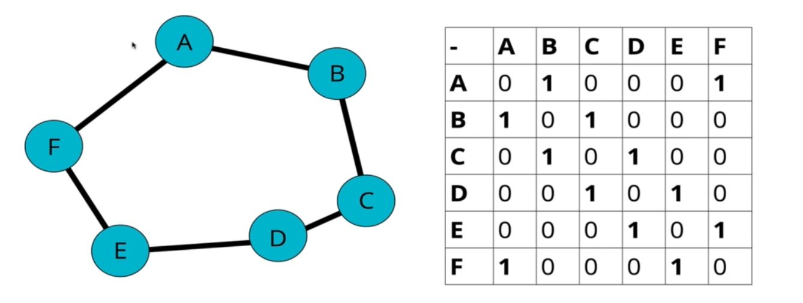
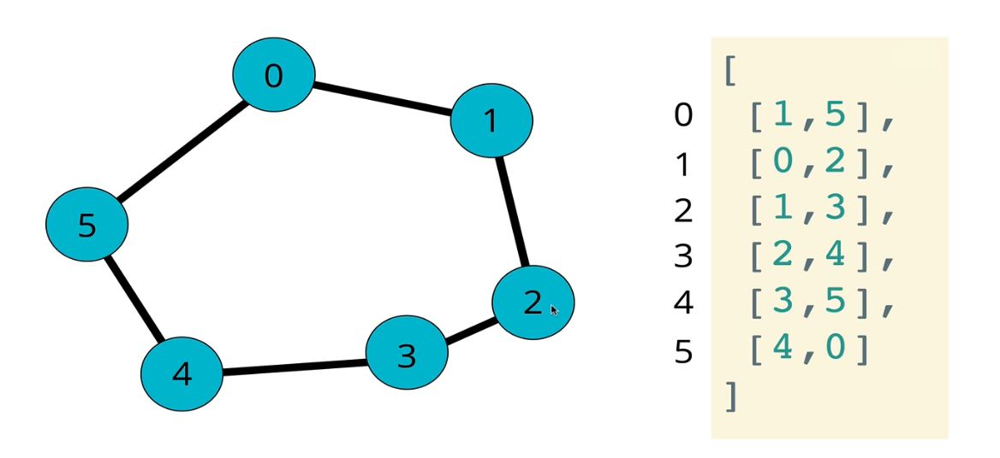
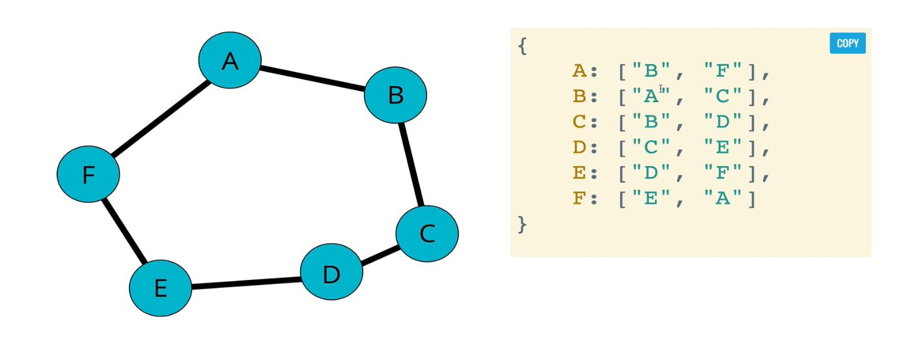
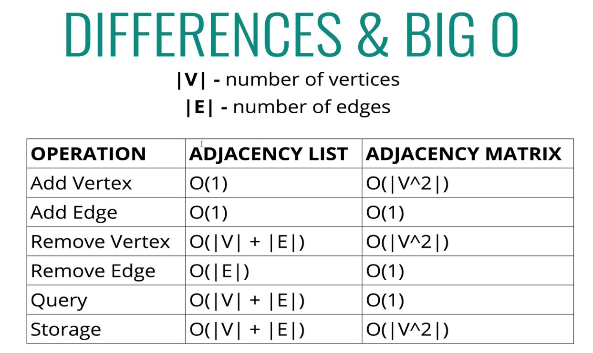

# Graphs

## 206: Intro to Graphs

- A collection of nodes and connections between those nodes.
- No specific pattern
- A set of nodes together with a set of unordered pairs of vertices for an undirected graph or a set of ordered pairs for a directed graph.

## 207: Uses for Graphs

- Social Networks
- Location / Mapping
- Routing Algorithms
- ETC...

## 208: Types of Graphs

### Terminology:

- **Vertex**: can think of a as a node, but for graphs.
- **Edge**: connections between nodes, can think of them as the line connecting two points.
- **Weighted / Unweighted**: Values assigned to edges between nodes, weighted has information about the edges themselves.
- **Directed / Undirected**: Directions assigned to edges between nodes, if there are directions it is Directed. Can think of arrows instead of lines.

- Can be weighted and directed, it is not one or the other.

## 209: Storing Graphs - Adjacency Matrix

- Matrix: two dimensional structure usually implemented with nested arrays.



## 209: Storing Graphs - Adjacency List

- With nested arrays.



## 210: Storing Graphs - Adjacency List

- With hashtables.



## 211 Adjacency List vs Adjacency Matrix Big O



| **Adjacency List**                            | **Adjacency Matrix**                                        |
| --------------------------------------------- | ----------------------------------------------------------- |
| **Can take up less space (in sparse graphs)** | Takes up a defined amount of space regardless of how sparse |
| **Faster to iterate over all the edges**      | slower to iterate over all the edges                        |
| can be slower to look up specific edges       | **Faster to look up specific edges**                        |
|                                               |                                                             |

- We will be learning Adjacency Lists
- Most real world data looks like the list

## 212: Add Vertex Intro & 213 Solution

### Graph Class:

```js
class Graph {
  constructor() {
    this.adjacencyList = {};
  }
}
```

- Before we can add edges, we have to add vertices (nodes)

### Adding a Vertex:

- Pseudo:

  - Accept the name of a vertex
  - Add a key to the adjacencyList
  - Set it's value to be an empty array.

- Code:

```js

//Method for adding vertices to our graph
addVertex(vertex){
  if(this.adjacencyList[vertex]) return //Protects from overrides
  this.adjacencyList[vertex] = [];      //Adds the property (vertex) to our adjacencyList object
}

```

## 214: Add Edge Intro & 215 Solution

- Pseudo:

  - Accept Two Vertices
    - vertex1
    - vertex2
  - Find in the adjacency list the key of vertex1 and push vertex2 to it's array
  - Find in the adjacency list the key of vertex2 and push vertex1 to it's array

- Code:

```js

// Method for adding Edge

addEdge(vertex1, vertex2){
  //Can add error handling here
  this.adjacencyList[vertex1].push(vertex2);
  this.adjacencyList[vertex2].push(vertex1);
}

```

## 216: Remove Edge Intro & 217 Solution

- Pseudo:

  - Accept Two Vertices
    - vertex1
    - vertex2
  - Find in the adjacency list the key of vertex1 and reassign it to an array with everything MINUS vertex2
  - Find in the adjacency list the key of vertex2 and reassign it to an array with everything MINUS vertex1

- Code:

```js

// Method for adding Edge

removeEdge(vertex1, vertex2){
  //Can add error handling here
  this.adjacencyList[vertex1] = this.adjacencyList[vertex1].filter( vertex => vertex !== vertex2);
  this.adjacencyList[vertex2] = this.adjacencyList[vertex2].filter( vertex => vertex !== vertex1);
}

```

## 218: Remove Edge Intro & 219 Solution

- Pseudo:

  - Accept One Vertex
  - Loop as long as there are any other vertices in the aList for that vertex
    - Inside loop, call `removeEdge` with the vertex we are removing and any values in the adjacency list for that vertex
  - Delete the passed in vertex

- Code:

```js

// Method for adding Edge

removeVertex(vertex){
  //Can add error handling here
  while(this.adjacencyList[vertex1].length){
    const adjacentVertex = this.adjacencyList[vertex].pop();
    this.removeEdge(vertex, adjacentVertex);
  }
  delete this.adjacencyList[vertex];
}

```
