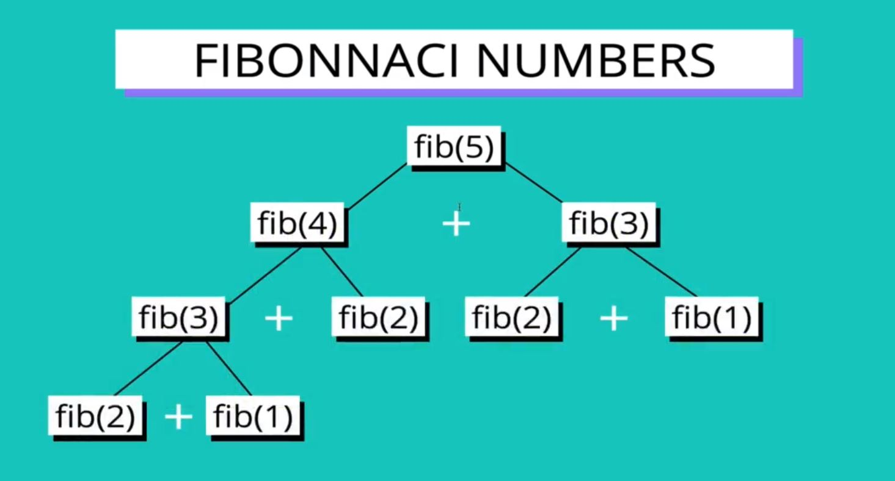
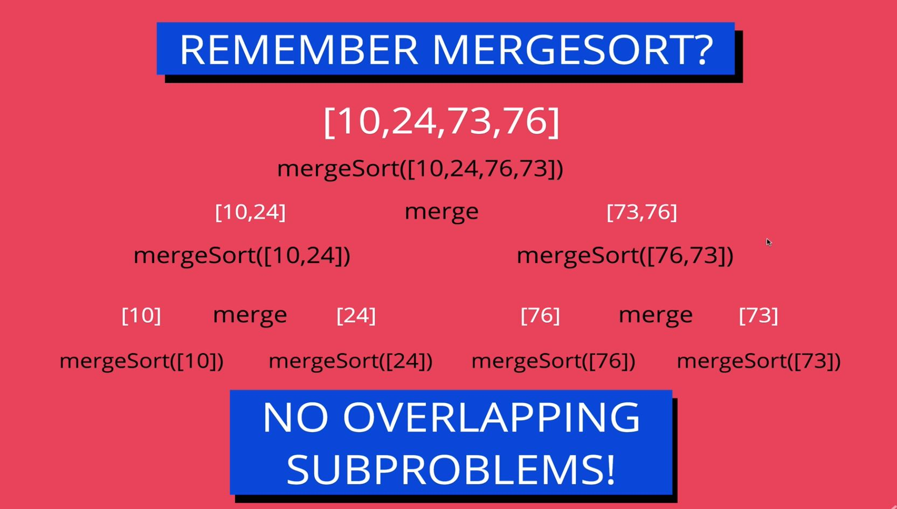
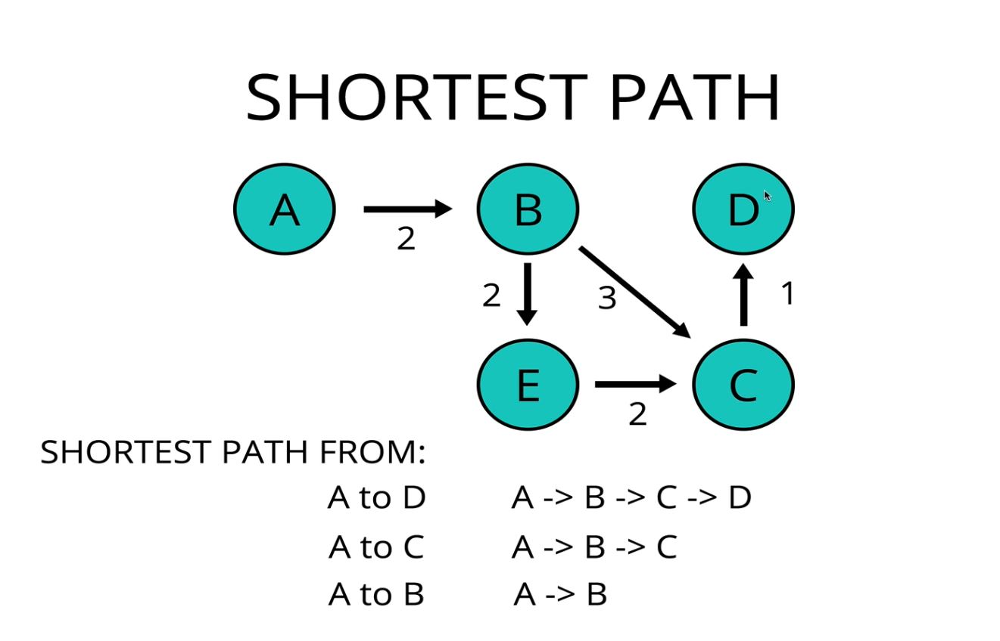
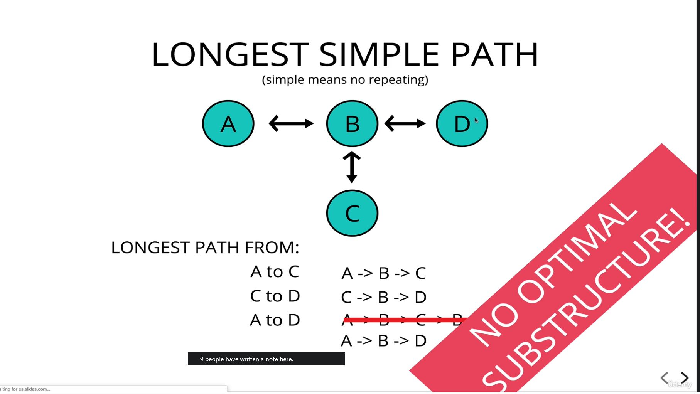
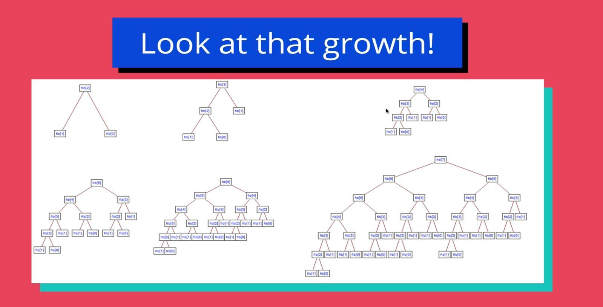
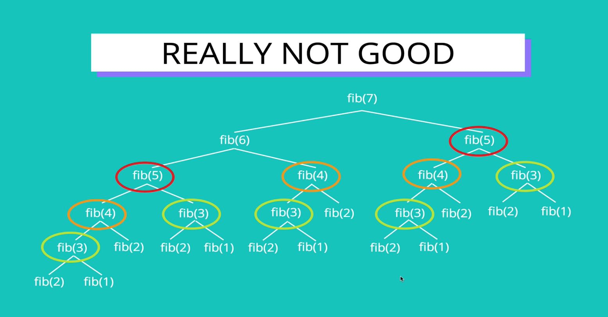

# Dynamic Programming 

## 239: Intro to Dynamic Programming

- This is a complex topic, more in depth than this course, but this will act as a light overview.

> **Dynamic Programming: A method for solving complex problems by breaking down the problems into collections of simpler subproblems just once, solving each of those subproblems just once, and storing their solutions.**

- It is an approach for solving a small subset of problems, it can't be used on everything, but the problems it can be used on, it really enhances their performance. 
- **What Dynamic programming really does is reduce running duplicate code by storing the solution to that portion of the code once it runs the first time.**

## 240: Overlapping Subproblems

- Dynamic Programming only works with problems with **optimal substructure** and **overlapping subproblems**.

> **Overlapping subproblems: A problem is said to have overlapping subproblems if it can be broken down into subproblems which are reused several times.**

- An example of a problem with overlapping subproblems, is the **Fibonacci Sequence**.



<br>

- In **recursion**, there are often subproblems involved, but that doesn't mean they overlap.
- Here we can see that with this problem we would need to solve for the same **(overlapping)** subproblem multiple times in order to derive the answer for the main problem.
  - For Example, we would need to solve `fib(3)` two times and `fib(2)` three separate times on our way to solving `fib(5)`.
  - If we were trying to solve for say `fib(100)`, there would be a ton of repetition. 
> **Overlapping subproblems repeat**

- An example of a problem with non-overlapping sub-problems is mergeSort:



## 241: Optimal Substructure

> **Optimal Substructure: A problem is said to have optimal substructure if an optimal solution can be constructed from optimal solutions of it's subproblem.**

- Optimal solutions can be things like best solution for each subproblem or the shortest path from one vertex to another. 



- Examples of a problem where you may think you would use Dynamic Programming, but don't, because there is no optimal substructure. 


<br>

## 242: Writing a Recursive Solution

``` js

  // Very inefficient 
  function fib(n){
    if(n <= 2) return 1;
    return fib(n-1) + fib(n-2);
  }

```

## 243: Time Complexity of Recursive Solution

- This solution is an **exponential solution: O(n^2)**
  - Significantly worst than even **quadratic** solutions which are **O(2^n)**


<br>

## 244: The Problem with Our Solution

> **Repetition, Repetition, Repetition, Repetition**


<br>

- **We could do much better if we remembered, instead of repeated...**

## 245: Enter Memoization!

> **Memoization: Storing the results of expensive function calls and returning the cached result when the same input occurs again.**

### A Memo-ized Solution: 

- Example is with the an array, but an object would work as well.

```js 

  // memo stores the answers to the subproblems
  function fib_memo(n, memo = []){
    // check for a stored solutions  first, short circuit if found
    if(memo[n] !== undefined) return memo[n];

    if(n <= 2) return 1;

    let res = fib(n - 1, memo) + fib(n-2, memo);

    // store the result in our memo array before returning
    memo[n] = res;

    return res;
  }

```

- **Another important thing to remember is that you can store your memo variable elsewhere, so that if your calculating the same numbers in the same function frequently, you would only have to calculate them once, and can refer back to that memo variable thereafter.**

## 246: Time Complexity of Memoized Solution

> Much Better! 
>
> Time Complexity: from **O(2^n)** to **O(n)**


## Tabulation: A Bottom Up Approach

- So far, with memoization, we have been using a *top-down* approach 

<br>

- We can also use a *bottom-up* approach 

> **Tabulation: Storing the results of a previous result in a "table" (usually an array)**
>
> Usually done using **iteration**.
>
> Better **space complexity** can be achieved using tabulation.

```js

  function fib_table(n){
    if(n <= 2) return 1;

    // this is our array that we are storing our results in
    let fibNums = [0, 1, 1];

    // We start with known values first and work up
    for(let i = 3, i <=  n; i++){
      fibNums[i] = fibNums[i - 1] + fibNums[i - 2]; // First pass fibNums[3] = fibNums[2] + fibNums[1]; 
    }

    return fibNums[n];
  }

```

- **fib_memo will cause a stack overflow! fib_table will not!!**