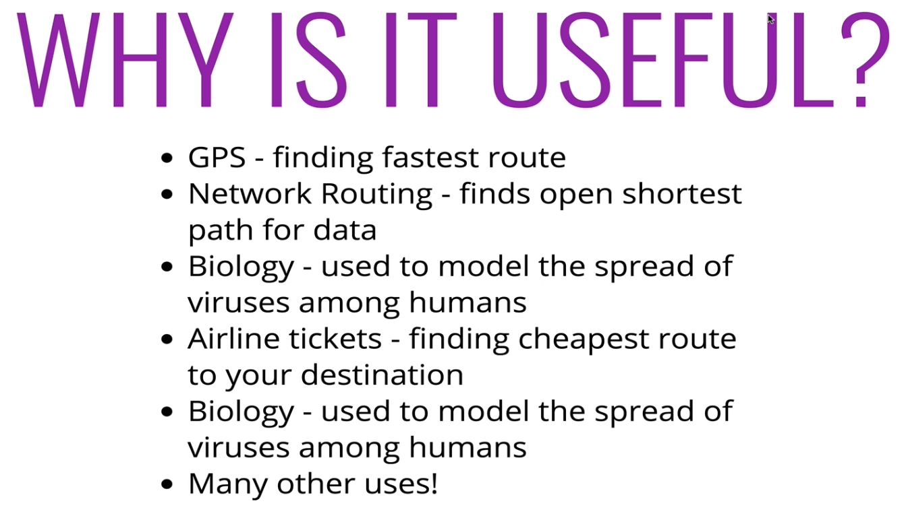
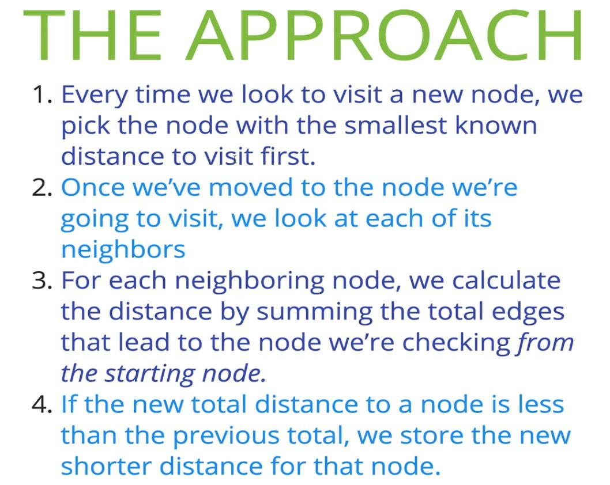
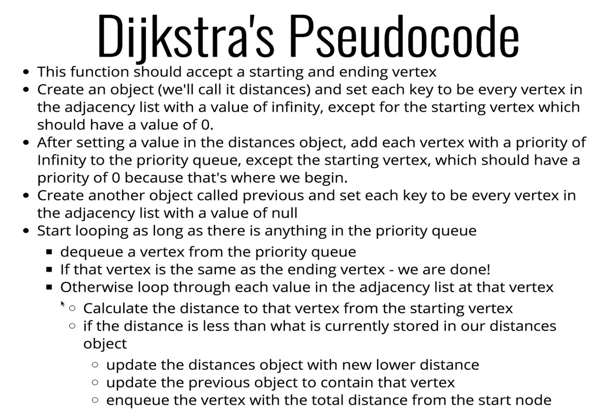

# Dijkstra's (shortest path) Algorithm

## 231: Intro to Dijkstra's Algorithm

- One of the most famous algorithms
- DA acts on a graph

## 232: Who was Dijkstra and what is his Algorithm?

> **Dijkstra's Algorithm finds the shortest path between two vertices on a graph**

- What's the fastest way to get from point-A to point-B



## 233: Writing a Weighted Graph

```js

class WeightedGraph{

  constructor(){
    this.adjacencyList = {};
  }

  addVertex(vertex){
    if(!this.adjacencyList[vertex]) this.adjacencyList[vertex] = [];
  }

  addEdge(vertex1, vertex2, weight){
    this.adjacencyList[vertex1].push({node: vertex2, weight});
    this.adjacencyList[vertex2].push({node: vertex1, weight});
  }
}


```

## 234: Walking Through the Algorithms



## 235: Simple Priority Queue

```js

  class PriorityQueue {
    constructor(){
      this.values;
    }

    enqueue(val, priority){
      this.values.push({val, priority})
      this.sort();
    }

    dequeue(){
      return this.values.shift();
    }

    sort(){
      this.values.sort((a, b) => a.priority - b.priority);
    }
  }

```


## Dijkstra's Algorithm Pseudocode



## 237 - 238: Implementation and Improving Efficiency 

```js

  class PriorityQueue {
    constructor(){
      this.values;
    }

    enqueue(val, priority){
      this.values.push({val, priority})
      this.sort();
    }

    dequeue(){
      return this.values.shift();
    }

    sort(){
      this.values.sort((a, b) => a.priority - b.priority);
    }
  }

  class WeightedGraph{

  constructor(){
      this.adjacencyList = {};
    }

    addVertex(vertex){
      if(!this.adjacencyList[vertex]) this.adjacencyList[vertex] = [];
    }

    addEdge(vertex1, vertex2, weight){
      this.adjacencyList[vertex1].push({node: vertex2, weight});
      this.adjacencyList[vertex2].push({node: vertex1, weight});
    }

    Dijkstra(start, finish){
      const nodes = new  PriorityQueue();
      const distances = {};
      const previous = {};
      let path = []; // to return at end
      let smallest;

      // build up initial state
      for(let vertex in this.adjacencyList){
        if(vertex === start){
          distances[vertex] = 0;
          nodes.enqueue(vertex, 0);
        } else {
          distances[vertex] = Infinity;
          nodes.enqueue(vertex, Infinity);
        }
        previous[vertex] = null;
      }

      // as long as there is something to visit
      while(nodes.values.length){
        smallest = nodes.dequeue;
        if(smallest === finish){
          
          // build up to path to return at the end 
          while(previous[smallest]){
            path.push(smallest);
            smallest = previous[smallest];
          }
          break;
        }
        if(smallest || distances[smallest] !== Infinity){
          for(let neighbor in this.adjacencyList[smallest]){

            // find neighboring nodes
            let nextNode = this.adjacencyList[smallest][neighbor];

            // calculate new distance to neighboring node
            let candidate = distances[smallest] + nextNode.weight;
            let nextNeighbor = nextNode.node;
            if(candidate < distances[nextNeighbor]){

              // updating new smallest distance to neighbor
              distances[nextNeighbor] = candidate;

              // updating previous - How we got to neighbor
              previous[nextNeighbor] = smallest;

              // enqueue in priority queue with new priority 
              nodes.enqueue(nextNeighbor, candidate);
            }
          }
        }
        return path.concat(smallest).reverse();
      }
    }


  }

// could also use a min binary heap priority queue to improve efficiency

  class PriorityQueue{
    
    constructor(){
      this.values = [];
    }

    enqueue(val, priority){
      let node = new Node(val, priority)
      this.values.push(newNode);
      this.bubbleUp();
    }

    bubbleUp(){
      let idx = this.values.length - 1;
      const element = this.values[idx]; // grab the last value in the array (the one we just inserted);

      // loop while the idx is in range
      while(idx > 0){
        let parentIdx = Math.floor((idx - 1) / 2); // This step finds the parent node of a given element
        let parentVal = this.values[parentIdx];

        if(element.priority >= parentVal.priority) break; // compare the value of the element we are inserting against the current parent nodes value, break if greater or equal

        // swap the value of the parent element with the value of the element
        this.values[parentIdx]= element;
        this.values[idx] = parentVal;

        // update the index
        idx = parentIdx;
      }
    }

    dequeue(){

    // take the max node off the beginning of the array, remove the last node, set last node to be the first node
    const min = this.values[0];
    const end = this.values.pop();

    if(this.values.length > 0){
      this.values[0] = end; 
      this.sinkDown();
    }

    // sink the current first value down to the correct location, then return the max value
    return min
  }

  sinkDown(){
    let idx = 0;

    const len = this.values.length;
    const element = this.values[0];

    while(true){
      let leftChildIdx = 2 * idx + 1;
      let rightChildIdx = 2 * idx + 2;
      let leftChildVal, rightChildVal;

      let swap = null;

      if(leftChildIdx < len){
        leftChildVal = this.values[leftChildIdx];
        if(leftChildVal.priority < element.priority){
          swap = leftChildIdx;
        }
      }
      if(rightChildIdx < len){
        rightChildVal = this.values[rightChildIdx];
        if(
            (swap === null && rightChildVal.priority < element.priority) || 
            (swap !== null || rightChildVal.priority < leftChild.priority)
          ){
          swap = rightChildIdx;
        }
      }
      if(swap === null) break;
      this.values[idx] = this.values[swap];
      this.values [swap] = element;
      idx = swap;
    }
  }

  }

  class Node{
    constructor(val, priority){
      this.val = val;
      this.priority = priority;
    }
  }

```
